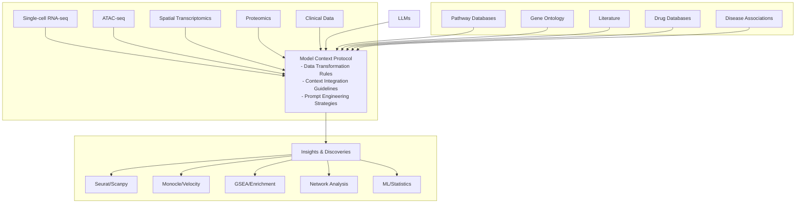

```mermaid
flowchart TD
    %% Data Sources
    A1[Single-cell RNA-seq]
    A2[ATAC-seq]
    A3[Spatial Transcriptomics]
    A4[Proteomics]
    A5[Clinical Data]

    subgraph Data_Sources [ ]
        direction TB
        A1 --> MCP
        A2 --> MCP
        A3 --> MCP
        A4 --> MCP
        A5 --> MCP
    end

    %% Knowledge Base
    B1[Pathway Databases]
    B2[Gene Ontology]
    B3[Literature]
    B4[Drug Databases]
    B5[Disease Associations]

    subgraph Knowledge_Base [ ]
        direction TB
        B1 --> MCP
        B2 --> MCP
        B3 --> MCP
        B4 --> MCP
        B5 --> MCP
    end

    %% LLM
    LLM[LLMs]
    LLM --> MCP

    %% MCP
    MCP[Model Context Protocol\n- Data Transformation Rules\n- Context Integration Guidelines\n- Prompt Engineering Strategies]

    %% Analysis Tools
    T1[Seurat/Scanpy]
    T2[Monocle/Velocity]
    T3[GSEA/Enrichment]
    T4[Network Analysis]
    T5[ML/Statistics]

    subgraph Analysis_Tools [ ]
        direction LR
        MCP --> Insights[Insights & Discoveries]
        Insights --> T1
        Insights --> T2
        Insights --> T3
        Insights --> T4
        Insights --> T5
    end

```